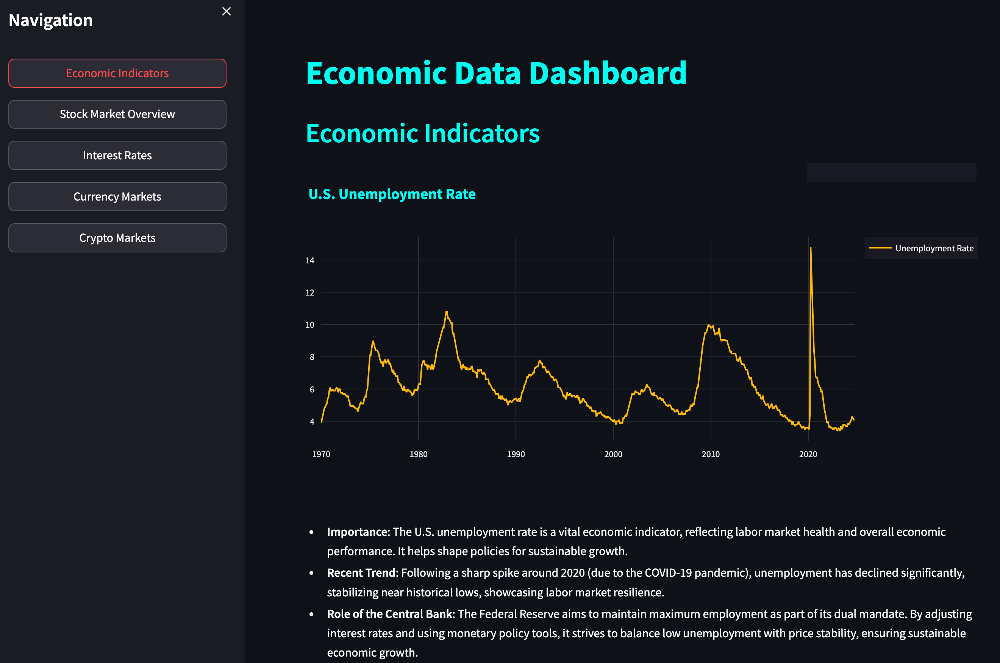

# Economic Data Dashboard
**🚀 Try the live dashboard: [Economics Dashboard on Streamlit Cloud](https://economics-workshop-dec-2024.streamlit.app/)**

<p align="center">
  
  <br>
  <em>Economic Indicators Dashboard showing unemployment rate trends and analysis</em>
</p>

A comprehensive economic data dashboard that combines data from multiple sources (Yahoo Finance, FRED, and cryptocurrency data) into a Streamlit application with automated data collection and visualization.

## Introduction

Hi, I'm **Ivan Brigida**, an Analyst at Google with a background in **Economics** and **Data Analysis**. Before joining Google, I worked in the banking sector, and 3 years ago, I started investing in **U.S. markets** while living in **Ireland**. My work and investing experience focus on using **economic data** to understand the economy, make financial decisions, and develop market strategies. You can read more about my approach in my [blog post about macro indicators affecting the stock market](https://pythoninvest.com/long-read/macro-indicators-affecting-stock-market).

Last year, I ran the **[Stock Markets Analysis Zoomcamp](https://pythoninvest.com/course)**, which attracted **1,800+ registrations**. I'll be running it again in **2025** to introduce participants to economic data with reduced technical complexity.

<p align="center">
  <a href="https://pythoninvest.com/course"></a>
</p>

---

### My Skills and Motivation

I'm skilled in:
- Writing **SQL code** for analysis and workflows.
- Building **graphs** and conducting data-driven analysis.
- Creating **basic trading strategies**, though they can get complex.

However, I want to avoid the overhead of tasks like:
- Managing **data pipelines** and **databases**.
- Ensuring **data integrity**.
- Coding **dashboards**, debugging **JavaScript**, or dealing with **CSS styles**.
- Handling **containerization** and deployment.

AI tools have helped me bridge these gaps, saving time and energy (at <$20/month). I'm focusing on what I do best while letting technology handle the rest.

---

### The Grand Idea 💡

This repository is a step toward a **generic Data Science project template** with solid foundational layers:
1. **Data storage** and **automated updates** for reliable, scalable data handling.
2. **Dashboards** for visualization and monitoring.
3. **Containers** for streamlined deployment.

With these pieces in place, the real focus can shift to **predictions**, **machine learning**, and advanced strategy development—what really matters for understanding markets and making decisions.

Explore the **TODOs** in the code and contribute your ideas to bring this vision to life!

## Features
- Real-time cryptocurrency data collection
- Daily economic indicators updates
- Interactive visualizations
- Professional dark theme UI
- Containerized deployment
- Automated data collection via cron jobs
- SQLite database for data storage
- Health monitoring and logging

## Project Structure
```
.
├── app.py                      # Streamlit application
├── utils.py                    # Shared utilities (DB, data loading, chart styling)
├── data/                       # Data directory
│   └── economics_data.db       # SQLite database
├── Dockerfile                  # Container configuration
├── requirements.txt            # Python dependencies
├── scripts/
│   ├── btc_minute_data.py     # Cryptocurrency data collection
│   ├── daily_job.sh           # Daily collection script
│   ├── fred_data_retrieval.py # Economic data collection
│   └── minute_job.sh          # Minute collection script
├── pages/                      # Dashboard pages
│   ├── economic_indicators.py  # Economic indicators page
│   ├── stock_market.py        # Stock market analysis
│   ├── interest_rates.py      # Interest rates page
│   ├── currency_markets.py    # Currency markets page
│   └── crypto_markets.py      # Cryptocurrency markets page
├── static/
│   └── css/
│       └── style.css          # Application styling
└── README.md                  # Project documentation
```

## Project Reproduction
For detailed instructions on how to reproduce this project from scratch using AI-assisted development, see [REPRODUCTION.md](REPRODUCTION.md).

## Quick Start

### Docker Deployment (Recommended)

#### Option 1: With Persistent Data (Volume Mounting)
Use this option to persist data between container restarts:
```bash
# Run this before, if you want to rebuild the container that is currently running:
docker stop finance_test && docker rm finance_test

# Then run the container:
docker build -t data_app .
docker run -d --name finance_test -p 8501:8501 -v $(pwd)/data:/app/data data_app
```
This will use existing data if available, or create new data if the directory is empty.

#### Option 2: Without Volume Mounting
Use this option for a fresh start or testing (e.g., when developing a new version):
```bash
# Run this before, if you want to rebuild the container that is currently running:
docker stop finance_test && docker rm finance_test

# Then run the container:
docker build -t data_app .
docker run -d --name finance_test -p 8501:8501 data_app
```
This will automatically run initial data collection on startup since no existing data is mounted.

### Verifying Initial Data Collection
After running the container for the first time, you can verify data collection:

1. Check data collection logs:
```bash
docker exec finance_test tail -f /var/log/cron.log
```
This will show the progress of initial data collection for both daily and minute data.

2. Verify collected data:
```bash
# Check BTC minute data
docker exec finance_test sqlite3 /app/data/economics_data.db "SELECT datetime, close, volume FROM btc_minute ORDER BY datetime DESC LIMIT 5;"

# Check daily economic data (e.g., SP500)
docker exec finance_test sqlite3 /app/data/economics_data.db "SELECT date, sp500, sp500_returns_daily FROM sp500 ORDER BY date DESC LIMIT 5;"
```

### Accessing the Dashboard
Access the dashboard at http://localhost:8501

### Managing Data Collection

1. To manually trigger data collection jobs:
```bash
# Run daily job
docker exec finance_test /app/scripts/daily_job.sh

# Run minute job
docker exec finance_test /app/scripts/minute_job.sh
```

2. Monitor logs:
```bash
# View cron job logs
docker exec finance_test tail -f /var/log/cron.log

# View container logs
docker logs finance_test

# Check data collection status
docker exec finance_test sqlite3 /app/data/economics_data.db "SELECT COUNT(*) FROM btc_minute;"
```

### Docker Cleanup
To remove unused Docker resources:
```bash
# List containers and images
docker ps -a
docker images

# Remove stopped containers
docker rm $(docker ps -aq)

# Remove unused images
docker rmi $(docker images -f "dangling=true" -q)
```

### Local Development (Advanced)
Note: The scripts are designed to run within the Docker container. For local development:

1. Install dependencies:
```bash
pip install -r requirements.txt
```

2. Run the Streamlit app:
```bash
streamlit run app.py
```

3. For data collection, it's recommended to use the Docker container as it handles all the necessary environment setup and scheduling.
